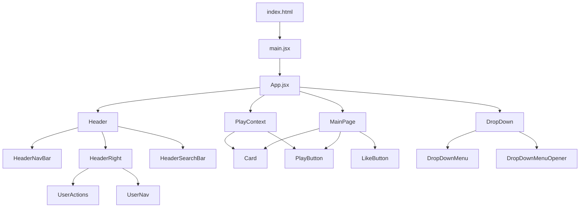

# Copy-SoundCloud

Клон SoundCloud на React + Vite

---

## Описание

Copy-SoundCloud — это учебный проект, реализующий основные функции музыкального сервиса SoundCloud: проигрывание треков, лайки, навигация по страницам, выпадающие меню и современный интерфейс.

---

## Структура проекта

```
Copy-SoundCloud/
├── index.html
├── package.json
├── package-lock.json
├── bun.lock
├── README.md
├── QUICK_START.md
├── eslint.config.js
├── tailwind.config.js
├── postcss.config.js
├── vite.config.js
├── .prettierignore
├── .prettierrc
├── /public/
│   ├── IMG_20250613_114149.png
│   └── soundcloud-svgrepo-com.svg
├── /src/
│   ├── main.jsx
│   ├── index.css
│   ├── App.jsx
│   ├── App.css
│   ├── /assets/
│   │   ├── like.svg
│   │   ├── react.svg
│   │   └── vite.svg
│   ├── /context/
│   │   └── PlayContext.jsx
│   ├── /data/
│   │   ├── music.data.js
│   │   └── user.data.js
│   ├── /components/
│   │   └── ... (см. подробности ниже)
│   └── /pages/
│       ├── MainPage.jsx
│       └── main.module.scss
└── ...
```

### Основные компоненты
- **Header** — верхняя панель с навигацией, поиском и профилем
- **MainPage** — главная страница с карточками треков
- **Card** — карточка трека
- **PlayButton, LikeButton** — кнопки управления
- **DropDown, DropDownMenu** — выпадающие меню
- **PlayContext** — глобальный контекст для управления воспроизведением

---

## Быстрый старт

1. Установите зависимости:
   ```sh
   npm install
   # или
   bun install
   ```
2. Запустите проект:
   ```sh
   npm run dev
   # или
   bun run dev
   ```
3. Откройте [http://localhost:5173](http://localhost:5173) в браузере.

---

## Используемые технологии

- **React** — UI библиотека
- **Vite** — быстрый сборщик
- **Tailwind CSS** — стилизация
- **SCSS-модули** — стили для компонентов
- **Bun** — альтернативный пакетный менеджер (опционально)
- **ESLint, Prettier** — линтинг и форматирование

---

## Визуальная схема компонентов



---

## Лицензия

MIT
